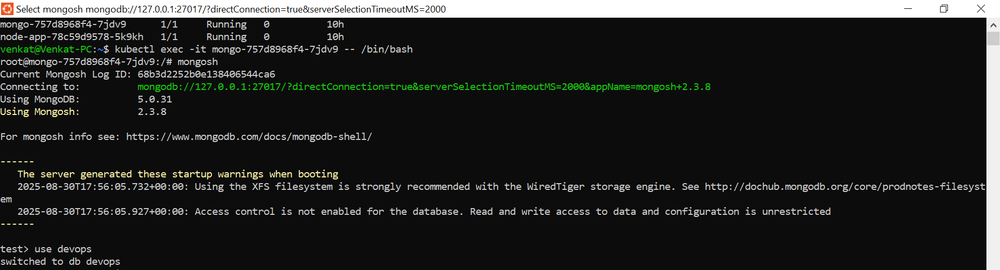

# This README file outlines the steps and approach I took to containerize the given app and deploy into Kubernetes cluster using Minikube. This repo contains Dockerfile and docker-compose.yml file used to dockerize the app. Also I have attached the relevant screenshots. Added k8s manifest files used for this deployment.

Below is the approach I took.
1) Installed Docker as Minikube runs inside Docker.
2) Installed Minikube in my Ubuntu24.04 WSL. Version installed: v1.36.0
3) Installed Kubectl for CLI. Client Version: v1.30.0
4) Below shows screenshots of pods and services deployed on Minikube cluster.

5) 
6) Screenshot showing mongodb as container

7) Screenshot showing entries made by Venkat on UI screen. I added few comments.

8) Below shows UI screen of the application.

9) DockerHub showing the image pushed.

